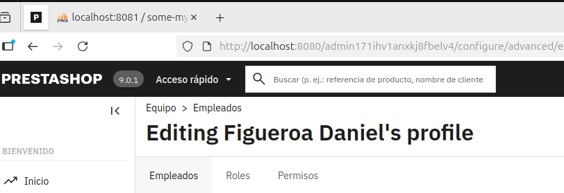
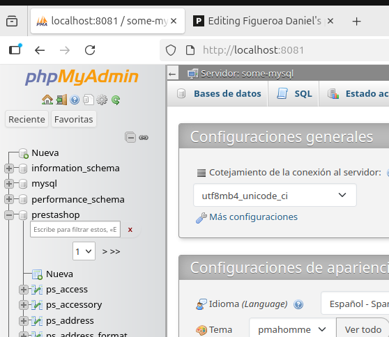
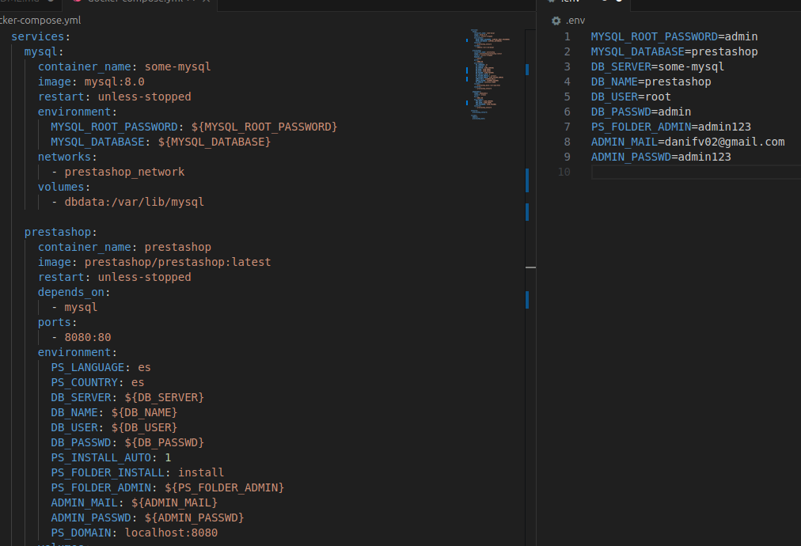

# Tarea 06 - PrestaShop con Docker Compose

## Estructura del docker-compose.yml

### Servicio `mysql`

Este servicio utiliza la imagen oficial de MySQL 8.0.
Se encarga de crear y mantener la base de datos que utilizará PrestaShop.

```yaml
mysql:
  container_name: some-mysql
  image: mysql:8.0
  restart: unless-stopped
  environment:
    MYSQL_ROOT_PASSWORD: admin
    MYSQL_DATABASE: prestashop
  volumes:
    - dbdata:/var/lib/mysql
  networks:
    - prestashop_network
```

### Servicio de `PrestaShop`

Lanza la aplicacion de PrestaShop usando el servicio de mysql.
Contiene la instalación automatica, para que se realice mas comodamente la configurarción.

```yaml
prestashop:
  image: prestashop/prestashop:latest
  depends_on:
    - mysql
  ports:
    - 8080:80
  environment:
    PS_LANGUAGE: es
    PS_COUNTRY: es
    DB_SERVER: some-mysql
    DB_NAME: prestashop
    DB_USER: root
    DB_PASSWD: admin
    PS_INSTALL_AUTO: 1
    PS_FOLDER_INSTALL: install
    PS_FOLDER_ADMIN: admin123
    ADMIN_MAIL: danifv02@gmail.com
    ADMIN_PASSWD: "753684291"
    PS_DOMAIN: localhost:8080
  volumes:
    - prestashop_data:/var/www/html
  networks:
    - prestashop_network
```

### Servicio `phpmyadmin`

Este servicio permite administrar gráficamente la base de datos.

```yaml
phpmyadmin:
  image: phpmyadmin
  ports:
    - 8081:80
  environment:
    PMA_HOST: some-mysql
    PMA_USER: root
    PMA_PASSWORD: admin
  networks:
    - prestashop_network
```

### PrestaShop Funcionando



### phpMyAdmin con Tablas de PrestaShop



## Añadido archivo .env

